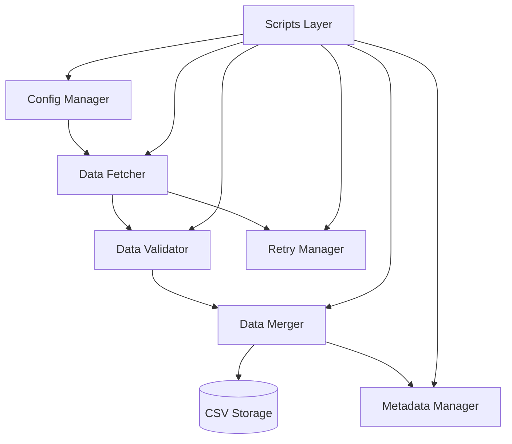

# Pipeline Architecture

This document describes the technical architecture of the Market Data Pipeline.

## System Overview



## Components

### 1. Configuration Manager (`config_manager.py`)

**Purpose**: Centralized configuration management

**Responsibilities**:
- Load YAML configuration files
- Validate configuration schemas
- Provide typed accessors for settings
- Cache loaded configurations

**Key Methods**:
```python
load_config()                    # Load all YAML files
validate_config()                # Validate required fields
get_stock_list() -> List[str]    # Get stock symbols
get_intervals() -> List[str]     # Get time intervals
get_config(key, default)         # Generic config getter
```

**Configuration Files**:
- `config.yaml` - Main pipeline settings
- `stocks.yaml` - Stock symbol definitions
- `indices.yaml` - Index symbol definitions

### 2. Data Fetcher (`data_fetcher.py`)

**Purpose**: Interface to Yahoo Finance API

**Responsibilities**:
- Fetch market data via yfinance
- Implement rate limiting
- Handle API-specific constraints
- Respect interval limitations

**Key Features**:
- **Rate Limiting**: Configurable delays between requests
- **Interval Limits**: Respects yfinance period limits per interval
- **Error Handling**: Graceful degradation on API errors
- **Timezone**: Converts to Asia/Kolkata timezone

**Data Flow**:
```
fetch_data(symbol, interval, period)
  → yfinance.download()
  → convert timezone
  → return DataFrame
```

**Interval Constraints**:
| Interval | Max Period | Max Days |
|----------|-----------|----------|
| 1m       | 7d        | 7        |
| 2m       | 60d       | 60       |
| 5m       | 60d       | 60       |
| 15m      | 60d       | 60       |
| 60m      | 730d      | 730      |
| 1d       | max       | unlimited|

### 3. Data Validator (`data_validator.py`)

**Purpose**: Ensure data quality and integrity

**Responsibilities**:
- Validate OHLCV data correctness
- Detect duplicates, gaps, and anomalies
- Auto-fix common issues
- Generate validation reports

**Validation Checks**:
1. **Required Columns**: Open, High, Low, Close, Volume present
2. **No Nulls**: No missing values in critical columns
3. **OHLC Logic**: High ≥ max(Open, Close), Low ≤ min(Open, Close)
4. **Duplicates**: No duplicate timestamps
5. **Sorted**: Data sorted chronologically
6. **Gaps**: Detect missing timestamps (interval-specific)
7. **Volume**: Non-negative volume values
8. **Price Range**: Reasonable price movements

**Auto-Fix Capabilities**:
- Remove duplicate rows
- Sort by timestamp
- Fill forward for small gaps (< threshold)
- Remove rows with null OHLCV values

**Validation Report Structure**:
```python
{
    'is_valid': bool,
    'issues': [
        {
            'severity': 'error|warning|info',
            'category': 'duplicates|gaps|nulls|...',
            'message': str,
            'details': dict
        }
    ]
}
```

### 4. Data Merger (`data_merger.py`)

**Purpose**: Combine existing and new data

**Responsibilities**:
- Merge new data with existing CSV files
- Deduplicate overlapping data
- Maintain chronological order
- Create backups before modifications

**Merge Strategy**:
```python
existing_df = load_existing_data(csv_path)
merged_df = merge_data(existing_df, new_df)
  → concatenate DataFrames
  → remove duplicates (keep newer)
  → sort by timestamp
  → return merged DataFrame
```

**Backup System**:
- Creates `.backup` files before overwrites
- Configurable backup retention
- Automatic cleanup of old backups

### 5. Metadata Manager (`metadata_manager.py`)

**Purpose**: Track download history and statistics

**Responsibilities**:
- Record download timestamps
- Track data statistics
- Validation result history
- Calculate next fetch dates

**Metadata Schema**:
```json
{
    "symbol": "RELIANCE.NS",
    "interval": "1d",
    "last_update": "2024-01-15T20:30:00",
    "total_rows": 5000,
    "date_range": {
        "start": "2020-01-01",
        "end": "2024-01-15"
    },
    "validation": {
        "status": "passed",
        "issues_count": 0,
        "last_validated": "2024-01-15T20:30:00"
    },
    "download_history": [
        {
            "timestamp": "2024-01-15T20:30:00",
            "rows_added": 1,
            "success": true
        }
    ]
}
```

**Key Methods**:
```python
update_metadata(symbol, interval, stats)
get_last_update(symbol, interval) -> datetime
needs_update(symbol, interval, max_age_hours) -> bool
get_next_fetch_date(symbol, interval) -> datetime
```

### 6. Retry Manager (`retry_manager.py`)

**Purpose**: Handle failures and implement retry logic

**Responsibilities**:
- Exponential backoff retry
- Failure logging and tracking
- Generate failure reports
- Optional alert callbacks

**Retry Strategy**:
```python
retry_with_backoff(func, max_retries, initial_delay)
  → attempt 1: immediate
  → attempt 2: wait initial_delay
  → attempt 3: wait initial_delay * 2
  → attempt 4: wait initial_delay * 4
  → max_delay cap: 60 seconds
```

**Failure Tracking**:
```json
{
    "symbol": "TCS.NS",
    "interval": "1d",
    "timestamp": "2024-01-15T20:30:00",
    "error": "Connection timeout",
    "metadata": {}
}
```

## Scripts Layer

### initial_download.py

**Purpose**: Initial bulk download of all data

**Workflow**:
```
1. Load configuration
2. Get all symbols (stocks + indices)
3. For each symbol:
   a. Create directory structure
   b. For each interval:
      - Fetch max available data
      - Validate data
      - Save to CSV
      - Update metadata
   c. Log progress
4. Generate summary report
```

**Features**:
- Progress bars (tqdm)
- Resume capability (skip existing)
- Force overwrite option
- Symbol/interval filtering
- Comprehensive logging

### daily_update.py

**Purpose**: Incremental daily updates

**Workflow**:
```
1. Load configuration
2. For each symbol:
   a. Read metadata
   b. Calculate date range to fetch
   c. Download new data
   d. Handle rolling windows (1m interval)
   e. Merge with existing data
   f. Validate merged data
   g. Update metadata
3. Generate update report
```

**Smart Update Logic**:
- **1m interval**: Replace with 7-day rolling window
- **Other intervals**: Append new data since last update
- **Skip**: Recently updated symbols (configurable threshold)

### validate_all.py

**Purpose**: Comprehensive data validation

**Workflow**:
```
1. Scan all data directories
2. For each CSV file:
   a. Check file integrity
   b. Validate data quality
   c. Check metadata consistency
   d. Identify gaps
   e. Categorize issues
3. Generate validation report
4. Create re-download script if needed
```

**Auto-Fix Mode**:
- Fixes validation issues in-place
- Creates backups before modifications
- Updates metadata post-fix

### fix_gaps.py

**Purpose**: Identify and fill data gaps

**Workflow**:
```
1. Scan all data files
2. Identify gaps using validator
3. Categorize gaps:
   - Valid: weekends, holidays
   - Fixable: missing trading days
   - Unfixable: data unavailable
4. For fixable gaps (if --auto-fix):
   a. Re-download gap period
   b. Merge with existing data
   c. Validate result
   d. Update metadata
5. Generate gap analysis report
```

**Holiday Detection**:
- NSE holiday calendar (2024-2026)
- Weekend detection
- Marks valid gaps (no re-download needed)

## Data Flow

### Initial Download Flow

```
User → initial_download.py
  ↓
ConfigManager.load_config()
  ↓
For each symbol:
  ↓
  DataFetcher.fetch_data(period="max")
  ↓
  DataValidator.validate_dataframe()
  ↓
  DataMerger.save_data()
  ↓
  MetadataManager.update_metadata()
  ↓
  (on error) → RetryManager.log_failure()
```

### Daily Update Flow

```
User/Cron → daily_update.py
  ↓
ConfigManager.load_config()
  ↓
For each symbol:
  ↓
  MetadataManager.get_next_fetch_date()
  ↓
  If needs_update:
    ↓
    DataFetcher.fetch_data(start_date, end_date)
    ↓
    DataMerger.merge_data(existing, new)
    ↓
    DataValidator.validate_dataframe()
    ↓
    DataMerger.save_data()
    ↓
    MetadataManager.update_metadata()
```

## Storage Layout

```
data/
├── stocks/
│   └── {SYMBOL}/
│       ├── 1m.csv
│       ├── 2m.csv
│       ├── 5m.csv
│       ├── 15m.csv
│       ├── 60m.csv
│       └── 1d.csv
├── indices/
│   └── {SANITIZED_SYMBOL}/  # ^NSEI → _NSEI
│       └── ...
└── metadata/
    └── {SYMBOL}_{INTERVAL}.json
```

## Error Handling Strategy

1. **Network Errors**: Retry with exponential backoff
2. **API Errors**: Log and continue with next symbol
3. **Validation Errors**: Auto-fix if possible, log issues
4. **Storage Errors**: Create backups, fail safely
5. **Configuration Errors**: Fail fast with clear messages

## Performance Considerations

- **Rate Limiting**: 0.5s delay between API calls
- **Batch Processing**: Process symbols in configurable chunks
- **Memory**: Lazy loading, process one symbol at a time
- **I/O**: Bulk operations, minimal file reopens
- **Parallelization**: Sequential (respects API limits)

## Extensibility Points

1. **New Data Sources**: Implement DataFetcher interface
2. **Custom Validations**: Add to DataValidator
3. **Storage Backends**: Replace DataMerger CSV logic
4. **Notification Systems**: Add callbacks to RetryManager
5. **Scheduling**: Multiple cron jobs, different intervals

## Security Considerations

- No API keys stored (yfinance is public)
- File permissions: user-only writes
- Input validation: symbol formats, date ranges
- Log sanitization: no sensitive data in logs

---

**Last Updated**: 2024-01-15
